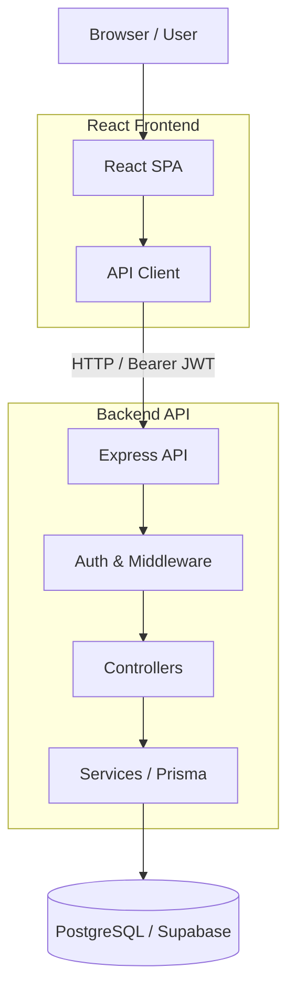

# System Architecture

The application is implemented as a modern React Single-Page Application (SPA) communicating with an Express HTTP REST API. The backend orchestrates business logic using a PostgreSQL database via the Prisma ORM.

## 1. High-Level Architecture
- **Frontend**: A React SPA styled using Tailwind CSS and structured with `react-router-dom`.
- **Backend**: An Express.js Node application layered into Routes, Controllers, and Services where applicable.
- **Database**: PostgreSQL (managed by Supabase) accessed via Prisma.
- **Authentication**: JWT-based authentication passed via HTTP Bearer headers.

## 2. Frontend Architecture
The client runs as an SPA without server-side rendering (SSR). 

- **Entry Point & Router**: `App.jsx` handles global `<BrowserRouter>` definitions and implements role-based route multiplexing using `<ProtectedRoute allowedRoles={[...]}>`.
- **AppShell**: A shared layout shell containing top-level navigation and the AuthContext provider.
- **AuthContext**: The primary global state mechanism. It manages authentication/session state (tokens, login/logout) and the small shared `alertCount` state. It is not a general-purpose state-management system.
- **API Client**: A centralized `lib/apiClient.js` wrapper utilizing `fetch` to automatically insert Bearer tokens and catch 401s for forced logouts.

**Implemented Page Structure:**
- **Instructor Views**: `Catalog.jsx`, `MyCoursesInstructor.jsx` (Course management), `CourseDetailInstructor.jsx` (Deep editing), `InstructorDashboard.jsx` (Analytical aggregation), `InstructorAlerts.jsx` (Inactivity resolution).
- **Learner Views**: `Catalog.jsx`, `MyCoursesLearner.jsx` (Personal enrollment progress), `CourseDetailLearner.jsx` (Lesson consumption).
- **Admin Views**: `AdminDashboard.jsx` (Lightweight UI dedicated solely to manual instructor provisioning).

*Implementation detail:* Routes such as `/courses/:id` and `/my-courses` utilize role-based multiplexing directly inside `App.jsx`, branching to either the Learner or Instructor component.

*Alert State Synchronization:* `AuthContext` owns the shared `alertCount`. The AppShell/navigation reads the count directly from `AuthContext`. The `InstructorAlerts` page updates the shared count after successful dismissal. There is NO `CustomEvent` listener in the final implementation.

## 3. Backend Architecture
The backend uses an explicit Express-based structure:
- **Routes & Middleware**: Mounts specific Express endpoints, enforcing authentication (`authenticateToken`) and role constraints (`requireRole`) via middleware.
- **Controllers**: The HTTP orchestration layer. Extracts request parameters/payloads, enforces authorization checks (e.g., verifying Learner `status !== 'DRAFT'`), triggers validation, and sends HTTP responses.
- **Services**: The core business logic layer housing multi-model manipulations (e.g., Course state transitions, Lesson reordering offsets, transaction cascades, dashboard aggregations) where used.
- **Prisma Data Access**: Most data access occurs directly through Prisma in the services or controllers. There is no mandatory repository layer used in the code.

## 4. Authentication and Authorization
- **Authentication**: `POST /api/auth/register` and `POST /api/auth/login` issue a JWT payload transported in `localStorage`. Public registration creates learners. Admins can provision instructors.
- **Role Authorization**: `requireRole('INSTRUCTOR')` blocks generic API access. Learners cannot modify instructor course content.
- **Resource Authorization (Ownership)**: Instructors must own the `course.instructorId` before they can modify details, reorder lessons, read dashboard aggregates, or dismiss inactivity alerts.
- **Learner Authorization (Enrollment & Content Access)**: Learner course access is NOT determined by enrollment alone.
  - `DRAFT` course: learner cannot access course content, even if bulk-enrolled.
  - `PUBLISHED` course: enrolled learner can access learner course content/progress.
  - `PUBLISHED` course: non-enrolled learner can see the catalog/course entry and can self-enroll.
  - `ARCHIVED` course: existing enrolled learner retains access/history according to the implemented behavior.

## 5. Core Domain Flows
- **Course Lifecycle**: Draft → Published → Archived. Publishing triggers validation rejecting empty courses.
- **Lesson CRUD/Reorder**: For lesson reorder, the implemented approach uses a two-phase safe position rewrite using temporary offsets and a Prisma transaction to avoid unique constraint collisions.
- **Enrollment**: Self-enrollment (Learner), instructor manual enrollment, and bulk enrollment.
- **Learner Progress**: Enrollment → lesson completion → derived enrollment status.
- **Activity/Comments**: Comment creation → comment persistence + activity-log entry inside a Prisma transaction.
- **Lesson Discussions**: A flat comment capability reusing the existing Activity/Comment infrastructure, allowing enrolled learners to post comments on specific lessons.
- **Lesson Resources**: Optional external resource links (URL and optional name) attached directly to lessons.
- **Quizzes**: Course-level MCQ quizzes with server-side scoring. They are independent of lessons and restricted to enrolled learners (if the course is published).
- **Inactivity Alerts**: Query-driven alerts. There is no cron, background worker, polling, or WebSocket. `IN_PROGRESS` enrollment → inactivity calculation → alert → episode-scoped dismissal.
- **CSV Export**: Authenticated request → relational data retrieved via Prisma → CSV string generated in memory as a response → frontend receives/downloads it as a Blob object URL. The current implementation is buffered/in-memory rather than streamed.

## 6. End-to-End Request Path Example
**Learner Completes a Lesson:**
1. Learner clicks "Complete Lesson" in the React `CourseDetailLearner` component.
2. The component calls `apiClient.post(\`/api/lessons/${lessonId}/complete\`)`.
3. The Express route intercepts the request at `POST /api/lessons/:id/complete`.
4. JWT authentication middleware verifies the token and identifies the user as a `LEARNER`.
5. The progress controller queries the database to ensure the learner is actively enrolled in the course and the lesson exists.
6. The service executes a Prisma transaction to write the `LessonProgress` record and updates the `Enrollment` status to `IN_PROGRESS` or `COMPLETED`.
7. PostgreSQL executes the write operations.
8. The Express controller returns a `200 OK` JSON response.
9. The frontend `CourseDetailLearner` component updates its local React state, replacing the "Complete" button with a green checkmark.

## 7. API Architecture
The REST API is partitioned into these representative functional route groups:
- **Auth**: `/api/auth/login`, `/api/auth/register`, `/api/auth/me`
- **Courses**: `/api/courses` (GET list, POST create), `/api/courses/:id` (GET, PATCH), `/api/courses/:id/publish`
- **Lessons**: `/api/courses/:id/lessons` (GET, POST), `/api/lessons/:id/reorder`, `/api/lessons/:id/complete`
- **Quizzes**: `/api/courses/:id/quizzes` (GET, POST), `/api/quizzes/:id` (GET, PATCH, DELETE), `/api/quizzes/:id/questions` (POST), `/api/quizzes/questions/:id` (PATCH, DELETE), `/api/quizzes/:id/submit` (POST)
- **Enrollment/Me**: `/api/courses/:id/enroll`, `/api/courses/:id/enroll-bulk`, `/api/me/enrollments`
- **Dashboard**: `/api/dashboard/summary`
- **Alerts**: `/api/alerts`, `/api/alerts/count`, `/api/courses/:id/alerts/:learnerId/dismiss`
- **Activity/Comments**: `/api/courses/:id/comments`, `/api/courses/:id/activity`
- **Lesson Discussions**: A flat comment capability reusing the existing Activity/Comment infrastructure, allowing enrolled learners to post comments on specific lessons.
- **Lesson Resources**: Optional external resource links (URL and optional name) attached directly to lessons.
- **Quizzes**: Course-level MCQ quizzes with server-side scoring. They are independent of lessons and restricted to enrolled learners (if the course is published).
- **CSV Export**: `/api/courses/:id/progress-export.csv`

## 8. Data Access / Query Design
Important query choices avoid N+1 queries and heavy application logic:
- **Learner My Courses**: Fetches `enrollment` data along with the nested `course` object in a single Prisma operation.
- **Lesson Progress**: Uses relational Prisma loading (`include: { progress: ... }`) to fetch lessons and the authenticated learner's progress simultaneously.
- **Dashboard Aggregation**: Uses raw SQL (`$queryRaw`) to aggregate metrics efficiently on the backend.
- **CSV Export**: Retrieves the required relational data (learners, enrollments, lesson progress) without executing per-row application queries, generating a fully buffered CSV string.
- **Catalog**: Search, filter, sort, and pagination are handled efficiently server-side.

## 9. Security Architecture
- Passwords are hashed with `bcrypt`.
- JWTs are verified by authentication middleware.
- Role checks, course ownership checks, and learner enrollment constraints are enforced server-side.
- Request inputs are validated via `zod`.
- Prisma's query engine parameterizes all standard data accesses. Raw SQL uses tagged-template parameterization (`${instructorId}`).
- Activity logs are protected by PostgreSQL `BEFORE UPDATE OR DELETE` database triggers.

## 10. Error Handling
- **API Errors**: Represented using standard HTTP status codes mapping to an `AppError` class structure in the backend.
- **Frontend Behavior**: `ApiError` is thrown by the API client. Components keep relevant error state and display the backend message (e.g. `error.message`). 401s are caught centrally to trigger logout.
- **Resilience**: Retry buttons are available where implemented. Empty states (e.g. no alerts, no courses) are explicitly distinguished from API failure states.

## 11. Deployment / Runtime Architecture
- **Frontend Tooling**: `vite` is used for frontend development and build tooling, not as a production hosting provider.
- **Backend Runtime**: Node.js and Express.js run the backend API server.
- **Database**: Supabase provides the managed PostgreSQL database. Environment variables (`DATABASE_URL`, `JWT_SECRET`) dictate connectivity.

## 12. What We Did Not Build
The following features were intentionally excluded from this scope:
- Email inactivity digests or notifications.
- Polling or WebSockets for real-time alerts (alerts are calculated purely on read).
- Background alert workers/cron jobs.
- Complex filters, sorting, or pagination on personal My Courses or Alerts screens.
- Full admin analytics or an Admin course-management UI.
- Unnecessary frontend state-management libraries (like Redux or Zustand).

## 13. Architecture Diagram

