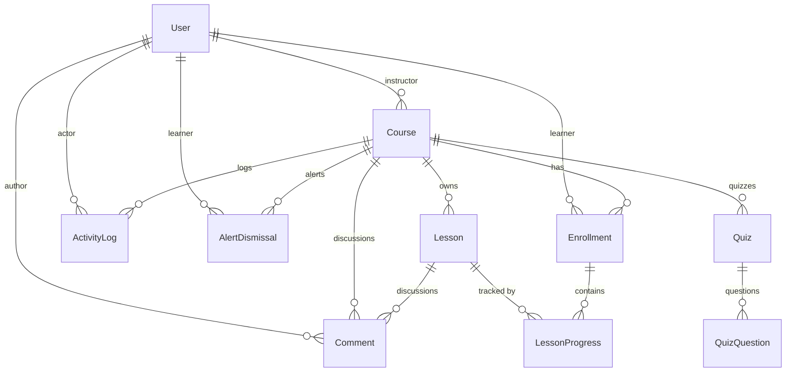

# Database Schema

The database for the application relies on PostgreSQL hosted by Supabase and is managed through Prisma ORM. All tables use UUID primary keys generated by Prisma (`String @id @default(uuid())`). Migrations are stored in the repository's `server/prisma/migrations` directory.

## 1. Tables and Columns

### User
| Field | Type | Nullable | Default | Description |
|---|---|---|---|---|
| id | String | No | uuid() | UUID Primary key. |
| email | String | No | - | Unique email address for the user. |
| password | String | No | - | Hashed password credential. |
| role | Role | No | LEARNER | Identifies the authorization tier (ADMIN, INSTRUCTOR, LEARNER). |
| createdAt | DateTime | No | now() | Standard timestamp. |
| updatedAt | DateTime | No | (auto) | Standard update timestamp. |

### Course
| Field | Type | Nullable | Default | Description |
|---|---|---|---|---|
| id | String | No | uuid() | UUID Primary key. |
| title | String | No | - | Display title of the course. |
| description | String | Yes | - | Informational synopsis. |
| category | String | No | - | Grouping identifier string. |
| status | CourseStatus | No | DRAFT | State machine value (DRAFT, PUBLISHED, ARCHIVED). |
| instructorId | String | No | - | Maps to `instructor_id`. The owning INSTRUCTOR of the course. |
| createdAt | DateTime | No | now() | Maps to `created_at`. |
| updatedAt | DateTime | No | (auto) | Maps to `updated_at`. |

### Lesson
| Field | Type | Nullable | Default | Description |
|---|---|---|---|---|
| id | String | No | uuid() | UUID Primary key. |
| courseId | String | No | - | Maps to `course_id`. Parent course identifier. |
| title | String | No | - | Title of the specific lesson. |
| content | String | No | - | Raw lesson text content. |
| position | Int | No | - | Sort-order integer controlling the sequence. |
| resourceUrl | String | Yes | - | Maps to `resource_url`. Optional external resource link. |
| resourceName | String | Yes | - | Maps to `resource_name`. Optional display name for the resource (requires resourceUrl). |
| createdAt | DateTime | No | now() | Maps to `created_at`. |
| updatedAt | DateTime | No | (auto) | Maps to `updated_at`. |

### Enrollment
| Field | Type | Nullable | Default | Description |
|---|---|---|---|---|
| id | String | No | uuid() | UUID Primary key. |
| learnerId | String | No | - | Maps to `learner_id`. The subscribed LEARNER. |
| courseId | String | No | - | Maps to `course_id`. The parent course. |
| status | EnrollmentStatus | No | NOT_STARTED | Computed progress milestone (NOT_STARTED, IN_PROGRESS, COMPLETED). |
| enrolledAt | DateTime | No | now() | Maps to `enrolled_at`. Original subscription date. |
| statusChangedAt | DateTime | No | now() | Maps to `status_changed_at`. Used significantly in Inactivity alerts. |

### LessonProgress
| Field | Type | Nullable | Default | Description |
|---|---|---|---|---|
| id | String | No | uuid() | UUID Primary key. |
| enrollmentId | String | No | - | Maps to `enrollment_id`. The parent enrollment. |
| lessonId | String | No | - | Maps to `lesson_id`. The specific completed lesson. |
| completedAt | DateTime | No | now() | Maps to `completed_at`. When the checkbox was clicked. |

### ActivityLog
| Field | Type | Nullable | Default | Description |
|---|---|---|---|---|
| id | String | No | uuid() | UUID Primary key. |
| courseId | String | No | - | Maps to `course_id`. The related course. |
| actorId | String | No | - | Maps to `actor_id`. User who executed the action. |
| actionType | ActivityActionType | No | - | Enum dictating the event action. Maps to `action_type`. |
| detail | Json | No | - | JSON payload documenting context. |
| createdAt | DateTime | No | now() | Maps to `created_at`. |

### AlertDismissal
| Field | Type | Nullable | Default | Description |
|---|---|---|---|---|
| id | String | No | uuid() | UUID Primary key. |
| learnerId | String | No | - | Maps to `learner_id`. Unresponsive LEARNER. |
| courseId | String | No | - | Maps to `course_id`. The related course. |
| episodeStart | DateTime | No | - | Maps to `episode_start`. Timestamp of the inactivity segment origin. |
| dismissedAt | DateTime | No | now() | Maps to `dismissed_at`. |

### Comment
| Field | Type | Nullable | Default | Description |
|---|---|---|---|---|
| id | String | No | uuid() | UUID Primary key. |
| courseId | String | No | - | Maps to `course_id`. Course this comment belongs to. |
| authorId | String | No | - | Maps to `author_id`. User (Instructor or Learner) who wrote it. |
| text | String | No | - | Raw comment text. |
| lessonId | String | Yes | - | Maps to `lesson_id`. Links the comment to a specific lesson. |
| createdAt | DateTime | No | now() | Maps to `created_at`. |
| updatedAt | DateTime | No | (auto) | Maps to `updated_at`. |

### Quiz
| Field | Type | Nullable | Default | Description |
|---|---|---|---|---|
| id | String | No | uuid() | UUID Primary key. |
| courseId | String | No | - | Maps to `course_id`. Parent course identifier. |
| title | String | No | - | Title of the quiz. |
| createdAt | DateTime | No | now() | Maps to `created_at`. |
| updatedAt | DateTime | No | (auto) | Maps to `updated_at`. |

### QuizQuestion
| Field | Type | Nullable | Default | Description |
|---|---|---|---|---|
| id | String | No | uuid() | UUID Primary key. |
| quizId | String | No | - | Maps to `quiz_id`. Parent quiz identifier. |
| question | String | No | - | The MCQ question text. |
| optionA | String | No | - | Maps to `option_a`. |
| optionB | String | No | - | Maps to `option_b`. |
| optionC | String | No | - | Maps to `option_c`. |
| optionD | String | No | - | Maps to `option_d`. |
| correctOption | String | No | - | Maps to `correct_option`. The correct answer (A, B, C, or D). |
| position | Int | No | - | Sort-order integer controlling the sequence. |
| createdAt | DateTime | No | now() | Maps to `created_at`. |
| updatedAt | DateTime | No | (auto) | Maps to `updated_at`. |

### Enum Values
- **Role**: `ADMIN`, `INSTRUCTOR`, `LEARNER`
- **CourseStatus**: `DRAFT`, `PUBLISHED`, `ARCHIVED`
- **EnrollmentStatus**: `NOT_STARTED`, `IN_PROGRESS`, `COMPLETED`
- **ActivityActionType**: `COURSE_CREATED`, `COURSE_UPDATED`, `COURSE_PUBLISHED`, `COURSE_ARCHIVED`, `COURSE_RESTORED`, `COMMENT_ADDED`, `QUIZ_CREATED`

---

## 2. Relationships

### One-to-Many
- **User → Course**: A User (instructorId) owns multiple Courses.
- **User → Enrollment**: A User (learnerId) has multiple Enrollments.
- **Course → Lesson**: A Course has multiple Lessons (`onDelete: Cascade`).
- **Course → Enrollment**: A Course has multiple Enrollments.
- **Course → ActivityLog**: A Course has multiple ActivityLogs (`onDelete: Cascade`).
- **Course → AlertDismissal**: A Course has multiple AlertDismissals (`onDelete: Cascade`).
- **Course → Comment**: A Course has multiple Comments (`onDelete: Cascade`).
- **Course → Quiz**: A Course has multiple Quizzes (`onDelete: Cascade`).
- **Quiz → QuizQuestion**: A Quiz has multiple QuizQuestions (`onDelete: Cascade`).
- **Lesson → Comment**: A Lesson can optionally have multiple Comments (`onDelete: Cascade`).
- **User → ActivityLog**: A User (actorId) creates multiple ActivityLogs.
- **User → Comment**: A User (authorId) writes multiple Comments (`onDelete: Cascade`).
- **User → AlertDismissal**: A User (learnerId) has multiple AlertDismissals (`onDelete: Cascade`).
- **Enrollment → LessonProgress**: An Enrollment contains multiple LessonProgress records (`onDelete: Cascade`).
- **Lesson → LessonProgress**: A Lesson is tracked by multiple LessonProgress records (`onDelete: Cascade`).

### Many-to-Many
- **Learner ↔ Course**: A many-to-many relationship implemented through the `Enrollment` join table.
- **Enrollment ↔ Lesson**: Represented through `LessonProgress`, which records a learner's completion of a lesson within a specific course enrollment.

---

## 3. Database vs Application Constraints

### Database-Enforced
Relational and data-integrity invariants are enforced in the database to prevent corruption regardless of the client or API interacting with it.
- **Primary Keys**: UUIDs on all tables.
- **Foreign Keys**: Enforcing existence of users, courses, enrollments, etc., including cascade deletions.
- **Unique User Email**: `email @unique` on `User`.
- **Unique Enrollment**: `@@unique([learnerId, courseId])` on `Enrollment`.
- **Unique Lesson Ordering**: `@@unique([courseId, position])` on `Lesson`.
- **Unique Lesson Progress**: `@@unique([enrollmentId, lessonId])` on `LessonProgress`.
- **Unique Alert Dismissal**: `@@unique([learnerId, courseId, episodeStart])` on `AlertDismissal`.
- **ActivityLog Immutability**: `ActivityLog` is append-only/immutable. PostgreSQL `BEFORE UPDATE OR DELETE` triggers prevent UPDATE and DELETE. The trigger implementation lives in the Prisma migration history, ensuring immutability is enforced at the database boundary rather than relying only on application code.

### Application-Enforced
Business workflow and authorization rules belong in application code because they depend on request/user context and domain state.
- **Role Authorization**: e.g., verifying if a user is an INSTRUCTOR before course creation.
- **Course Ownership**: e.g., verifying `instructorId` matches the authenticated user before modifying a course.
- **Course State Transitions**: Moving from DRAFT to PUBLISHED or ARCHIVED.
- **Publish Blocking**: Preventing publishing when there are no lessons.
- **Learner Access Rules**: A learner may have a draft enrollment because bulk enrollment can prepare a roster, but that enrollment does not grant access to draft content.
  - Draft → learner content unavailable.
  - Published + enrolled → accessible.
  - Archived + existing enrollment → retained access/history.
- **Comment Authorization**: Learners must be enrolled (and the course must not be DRAFT) to comment.
- **Enrollment Status Transitions**: Moving from NOT_STARTED to IN_PROGRESS to COMPLETED.
- **Inactivity Alerts**: The logic of what constitutes "14 days inactive" and reading the data.

*Note: `ARCHIVED` is a course status. Archiving does not delete lessons or enrollments at the database level. Application catalog/authorization rules determine what learners can see.*

---

## 4. Deliberate Denormalization

No broad denormalization of the core relational model was introduced.
- **`Enrollment.status` and `statusChangedAt`**: `Enrollment.status` is a stored, materialized progress state derived from lesson progress. It is kept alongside `statusChangedAt` for efficient progress querying and inactivity detection, avoiding expensive relational counts on every read.

Catalog enrollment counts are calculated dynamically at query time using aggregate functions rather than being stored as dedicated denormalized columns.

---

## 5. What Would Break First at 100x?

At 100x the data volume, likely pressure points include:
- **Catalog Search/Count Queries**: The catalog heavily relies on dynamic filtering and counting `enrollments` for sorting. As rows grow, `COUNT()` aggregations on large unfiltered sets will slow down PostgreSQL.
- **Dashboard Aggregation Queries**: The dashboard calculates `totalLearners`, `learnersInProgress`, and `completionTrend` dynamically over the entire history. This will become a bottleneck.
- **Inactivity Alert Queries**: Scanning the entire `enrollments` table for `status = 'IN_PROGRESS'` and `statusChangedAt < 14 days ago` will become more expensive as the table grows.
- **Buffered CSV Generation**: Progress exports query relational data in the backend and construct the entire file in memory before sending the response. For a very large course with thousands of learners, this will cause memory pressure and request timeouts.

Future scaling directions could involve query/index optimization, precomputed reporting data, or streaming large CSV exports.

---

## 6. ER Diagram

